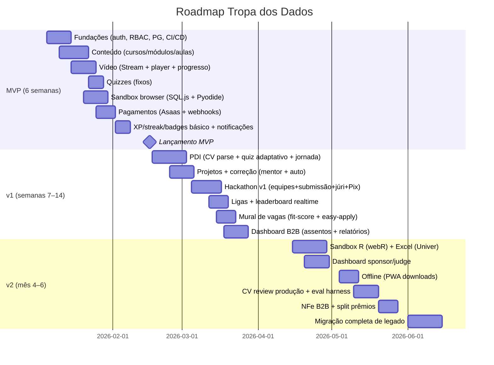

# Tropa dos Dados — Spec Mestre da Plataforma

**Status:** baseline consolidado (source of truth)
**Versão:** 1.0 — v0 (MVP) → v1 → v2
**Escopo:** plataforma própria de educação em dados, multiaudência (B2C, B2B empresas, instituições, patrocinadores/jurados de hackathon). Substitui Cakto/Hotmart.

> Este documento é o **single source of truth**. Ele consolida os 4 agentes:
> 1. **UX/UI** — sitemap, design system, telas, onboarding, gamificação
> 2. **Aprendizado & Disciplina** — modelo pedagógico, motor PDI, retenção
> 3. **Arquitetura Técnica** — monólito modular, sandbox, vídeo, pagamentos, IA
> 4. **Negócio & ICP** — mercados, precificação, metas, moat
>
> Toda decisão de produto/código deve referenciar a seção correspondente; divergências de implementação devem voltar para cá.

---

## 0. Decisões executivas (TL;DR)

| Área | Decisão |
|---|---|
| Posicionamento | Escola de dados BR que combina **4 modos de aprender** (assistindo, fazendo, jogando, do meu jeito) + **hackathons recorrentes com prêmio em dinheiro** + PDI personalizado. Ninguém no Brasil combina isso. |
| Público | 6 ICPs: alunos solo, profissionais em aperfeiçoamento, empresas L&D, instituições de ensino (seats), patrocinadores de hackathon, white-label futuro. |
| Pedagogia | Metáfora militar (Tropa/Missões/Patentes), XP como moeda única, sprints de 25 min, PDI atualizado a cada 2 semanas, mastery ≥80%, repetição espaçada, ligas (estilo Duolingo). |
| Monetização | 3 pernas: B2C (R$59–149/mês), B2B seats, sponsors (prêmio + taxa). A plataforma NUNCA financia prêmio do próprio bolso (exceto 1 hackathon de lançamento). |
| Arquitetura | Monólito modular (1 repo, 3 processos: Next.js web, NestJS API, BullMQ worker). |
| Banco/Dados | PostgreSQL 16 + Prisma; Redis (fila+cache+rate limit); UUID v7; dinheiro em centavos. |
| Vídeo | Cloudflare Stream (~$5/1k min armazenados + $1/1k min entregues); R2+CDN sem egress. |
| Sandbox | Híbrido: WASM no browser (SQL.js/DuckDB, Pyodide, webR, Univer) para aprender; Modal (gVisor)→e2b→K8s para grading seguro. |
| Pagamentos | Asaas como PSP via camada de abstração própria (não construir Pix/cartão do zero). |
| IA | Proxy próprio (OpenAI primary + Gemini fallback) com Structured Outputs; guardrails LGPD. |
| Realtime | Socket.IO + Redis adapter (leaderboards, eventos, notificações). |
| Auth | Auth.js v5 + Argon2id + JWT curto/refresh opaco; RBAC multi-role. |
| Monitoramento | Sentry + OpenTelemetry → Grafana Cloud (LGTM). |
| Deploy | **Railway** (Primary) — 3 serviços + plugins Postgres/Redis; Fly.io como fallback; K8s só no estágio D. |

---

## 1. Visão e Produto

### 1.1 Problema

Alunos brasileiros de dados não têm uma única plataforma que:
- Ensine com **aulas gravadas de qualidade** (DataMundo não tem aulas gravadas)
- Dê **prática real** com sandbox de SQL/Python/R/Excel
- **Personalize a jornada** por CV + quiz + estilo de aprendizado (PDI)
- Conecte a **oportunidades reais** (mural de vagas, empresas, talent database)
- Crie **motivação de longo prazo** (gamificação + hackathons com prêmio em dinheiro)

O custo da falta disso: alunos começam, abandonam (D30 baixo), e nunca chegam à vaga.

### 1.2 4 Modos de Aprender (+ jornada própria)

| Modo | Mecânica | Formato |
|---|---|---|
| **Aprender assistindo** | Vídeo + transcrição + anotações com timestamp + quizzes fixos | Aulas gravadas (CF Stream) |
| **Aprender fazendo** | Sandbox no browser + projetos com correção (auto/mentor) | SQL/Python/R/Excel, projetos |
| **Aprender jogando** | XP, streaks, badges, ligas, missões | Gamificação completa |
| **Aprender do meu jeito** | PDI personalizado (CV + quiz adaptativo + estilo) que gera a jornada | Motor PDI |

### 1.3 Diferenciais defensáveis (moat)

1. **PDI personalizado** — CV parse + quiz adaptativo (IRT) + learning style → jornada única. Quanto mais o aluno usa, mais o PDI melhora.
2. **Rede de patrocinadores** — empresas pagam por hackathons e recebem talentos; relação exclusiva.
3. **Talent database** — fit-score CV↔vaga; recrutadores pagam para acessar (ou vem via patrocínio).
4. **Comunidade + dados de aprendizagem** — dados de progresso de milhares de alunos = moat de dados para B2B.

---

## 2. Público (ICPs)

| ICP | Dor | Oferta | Como entra |
|---|---|---|---|
| **Aluno solo** (B2C) | Não sabe por onde começar, abandona | Trilha + PDI + comunidade + hackathon | Assinatura R$59–149/mês |
| **Profissional em aperfeiçoamento** | Estagnou, precisa de portfólio/vaga | PDI + projetos + mural de vagas | Assinatura (muitas vezes anual) |
| **Empresa treinando equipe** (L&D) | Time sem trilha de dados, sem medir progresso | Assentos B2B + dashboard de engajamento | Contrato anual / seats |
| **Instituição de ensino** | Complementar formação com prática | Lotes de seats + trilhas customizadas | Contrato |
| **Patrocinador de hackathon** | Precisa de talentos + marca | Hackathon white-label + talent database | Patrocínio (prêmio + taxa) |
| **White-label futuro** | Quer plataforma própria | Whitelabel da plataforma | Parceria v2 |

> **Recrutador individual NÃO é ICP** — entra como benefício do patrocínio (talent database), não como produto standalone.

### 2.1 Personas

- **"Lara" (22–30, B2C)** — recém-formada em adm/eng, quer migrar pra dados, medo de não conseguir, assiste aula sozinha.
- **"Carlos" (30–40, B2C/B2B)** — analista estagnado, precisa de portfólio e vaga; paga caro por mentorias hoje.
- **"Dra. Mariana" (L&D)** — head de educação corporativa; precisa de trilha mensurável para equipe de BI.
- **"Sr. Azevedo" (Patrocinador)** — dono de empresa de tech que quer prêmio + marca + pipeline de talentos.

---

## 3. Modelo Pedagógico e Disciplina

### 3.1 Metáfora militar (tema da marca)

A plataforma usa a metáfora **Tropa** (uniforme, patentes, missões, batalhões) para gerar pertencimento e motivação:
- **Missão** = unidade de aprendizado de ~10–20 min (uma aula, um exercício, um quiz)
- **Sprint** = 25 min de foco com timer (técnica pomodoro)
- **Ofensiva do dia** = 1 foco principal recomendado pelo PDI
- **Patentes** = níveis (Soldado → Recruta → Sargento → ...) derivados de XP
- **Batalhões** = ligas semanais de 30–50 alunos

### 3.2 Motor PDI (Jornada Personalizada)

Entrada (3 fontes):
1. **CV** — upload (PDF/DOCX) → parse estruturado (experiência, skills, educação)
2. **Quiz adaptativo** — IRT 1PL, ~10–15 perguntas por skill
3. **Questionário de estilo** — leve (visual/auditivo/leitura/prático), sem prometer DISC/MBTI clínico

Saída:
- Vetor de skill (0–5 por skill na taxonomia S0–S5)
- Gap = alvo de carreira − vetor atual
- **Jornada** (grafo de `pdi_nodes`): milestones → skills → cursos → projetos → hackathons
- Home mostra "sua missão da semana" derivada do PDI

**Cadência:** PDI atualizado a cada **2 semanas** (novo quiz adaptativo + progresso); gates de mastery ≥80% para liberar próximo nó.

### 3.3 Hábito e retenção

- **Streaks** com freezes (2/trimestre), timezone-aware
- **Ligas semanais** (Duolingo-style): promoção top 15%, rebaixamento bottom 15%
- **Repetição espaçada** de conceitos-chave via quizzes
- **Detecção de abandono**: sem atividade 5 dias → notificação; 10 dias → e-mail + oferta de retomada
- **North star**: missões completadas/semana (meta ≥ 70% de conclusão de missão iniciada)

### 3.4 Métricas de aprendizado

| Métrica | Alvo |
|---|---|
| Retenção D30 | ≥ 45% |
| Conclusão de missão iniciada | ≥ 70% |
| Missões/semana por aluno ativo | ≥ 3 |
| Tempo ativo semanal (alunos ativos) | ≥ 60 min |
| % alunos com PDI ativo | ≥ 60% |
| Progresso no PDI (nós concluídos/mês) | ≥ 4 |

---

## 4. UX/UI

### 4.1 Princípios

- **Menos é mais**: uma ação primária por tela; navegação por missões, não por menus.
- **Feedback constante**: XP, streak, progresso visual sempre presentes (game feel).
- **PT-BR em tudo**: microcopy com voz de "comandante" (motivadora, não paternalista).
- **Acessibilidade**: WCAG 2.2 AA; contraste, foco, leitor de tela, textos alternativos.
- **Mobile-first para consumo, desktop para sandbox**.

### 4.2 Sitemap (macro)

```
/ (landing marketing)
/login · /signup
/onboarding (wizard) → wizard PDI
/app (dashboard)
/app/trilhas            → curso/módulo/missão → player · quiz · sandbox
/app/projetos           → submissão · correção
/app/hackathons         → hackathon center (lista, ativos, ranking, submissão)
/app/vagas              → mural com fit-score · easy-apply
/app/cv                 → upload · review IA · export
/app/pdi                → jornada · gap de skills · próxima missão
/app/ligas              → leaderboard semanal
/app/perfil             → badges, conquistas, configurações
/empresa/*              → dashboard B2B (seats, progresso, relatórios)
/sponsor/*              → dashboard patrocinador/jurado
/admin/*                → conteúdo, planos, usuários, finanças
```

### 4.3 Design system

- Tokens 3 camadas (primitive → semantic → component) via CSS variables
- **Dark theme** padrão (tema militar/tech), light alternativo
- Tipografia: fonte display forte + texto legível (PT-BR completo)
- Cores: base escura + 1 cor de ação (brand) + cores de feedback (XP=dourado, streak=fogo)
- Componentes: shadcn/ui (Radix + Tailwind) — modal, dropdown, form, table, toast, tabs
- **Mascote "Capitão"** — guia o onboarding e celebra conquistas (não infantil — estilo "comandante de esquadrão")

### 4.4 Onboarding + wizard PDI (6 passos)

1. **Meta** — "O que você quer alcançar?" (Analista de Dados, Cientista, Engenheiro, BI, Migração, Aperfeiçoar)
2. **Quiz adaptativo** — 10–15 perguntas por skill (IRT)
3. **Upload de CV** (opcional mas incentivado com +XP) → parse
4. **Estilo de aprendizado** — 4 perguntas leves
5. **Tela PDI** — "Sua jornada está pronta" (animação de montagem da trilha)
6. **Primeira missão** — lança o aluno direto na primeira missão (ação > configuração)

Onboarding é dividido em "pílulas" de 1–2 min para não assustar; reentrada possível.

### 4.5 Telas core

- **Player**: vídeo + transcrição clicável + anotações @timestamp + quiz no fim
- **Sandbox**: editor + console + datasets + verificação de execução; R/Excel lazy-load
- **Hackathon center**: contagem regressiva, tema, prêmios, inscrição em equipe, submissão, jurados, placar
- **Vagas**: fit-score do CV vs vaga, easy-apply, histórico
- **PDI**: árvore da jornada, nós concluídos/futuros, gap por skill
- **Dashboard**: "próxima missão" grande + streak + XP + ofensiva do dia
- **Admin conteúdo**: upload de vídeo (TUS), publicação, quizzes, datasets

### 4.6 Riscos de UX (top)

1. Sandbox R/webR pesado no browser → progress loader + fallback server
2. Wizard PDI longo → pílulas + reentrada
3. Fricção de pagamento → trial com cartão explicado, Pix nativo
4. Leaderboard desmotivando quem está atrás → meta pessoal vs liga
5. Excesso de notificações → preferências + digest

---

## 5. Arquitetura Técnica

> Detalhes completos: [02-arquitetura.md](02-arquitetura.md) (gerado pelo agente de arquitetura). Resumo executivo:

### 5.1 Visão geral

- **Monólito modular**: 1 repo, 3 processos — `app-web` (Next.js 15 SSR+PWA), `app-api` (NestJS/Fastify + Socket.IO gateway), `app-worker` (BullMQ)
- **Deploy: Railway (Primary)** — 3 serviços + plugins gerenciados de PostgreSQL 16 e Redis. Fly.io como alternativa de fallback. K8s (GKE/EKS/DO) apenas no estágio D (100k usuários), e só com operador dedicado.
- Por que 3 processos: webhooks estáveis (Asaas/Stream), jobs longos (settlement, dunning, grading), conexões websocket

### 5.2 Railway (decisão de deploy)

| Item | Decisão | Observação |
|---|---|---|
| Modelo | **3 serviços (web/api/worker) + 2 plugins (PG, Redis)** | Railway trata cada serviço como um container no mesmo projeto; rede privada entre eles (DNS `.railway.internal`) |
| Postgres | **Plugin Railway Postgres** (não Neon/Supabase) | mesma região, baixa latência, backups, tuning fácil no MVP; migrar p/ RDS só no estágio C se precisar |
| Redis | **Plugin Railway Redis** | BullMQ + cache + rate limit num só serviço gerenciado |
| Deploy | GitHub Actions → `railway up` ou Dockerfile por serviço | CI roda lint→typecheck→test→migrate antes de publicar |
| Região | Usar região mais próxima do Brasil (ex.: us-east) | BR tem maior latência; para MVP aceitável; no estágio C avaliar réplica regional |
| Escala | Horizontal: 1 instância cada no início, réplicas sob demanda | workers escalam independente; web/api escalam com tráfego |
| WebSocket | Socket.IO funciona em Railway (long-lived connections) | garantir timeout/keep-alive adequados |
| Upload de vídeo | Não passa pelo Railway — vai direto ao Cloudflare Stream (TUS) | Railway serve só a aplicação, não arquivos grandes |
| Custos estimados | ~R$600/mês (web+api+worker+PG+Redis no estágio A) | dentro do modelo de ~R$2/aluno ativo/mês |
| Backups | Plugin PG com backups + PITR; testar restore mensal | atende RPO ≤15min / RTO ≤4h do estágio A |
| Migração futura | Se precisar sair, tudo é Docker → portável para Fly.io/GCP/AWS | imagem única por processo facilita o move |

**Cuidados práticos no Railway:**
- Não usar serverless/Zero-downtime para o `app-worker` — jobs longos não podem morrer com cold start; usar **Service** (sempre ativo), não Deploy
- Webhook endpoints (Asaas/Stream) precisam ser Services estáveis, nunca serverless
- Volume/disk efêmero: não persistir estado em disco (uploads/arquivos vão para R2; filas no Redis; DB no plugin)
- Variáveis de ambiente via Railway env (nunca no repo); segredos reais via Doppler integrado

### 5.2 Stack

| Camada | Tecnologia |
|---|---|
| Web | Next.js 15 App Router, React 19, TypeScript strict, PWA |
| API | NestJS 11 + Fastify |
| ORM/DB | Prisma + PostgreSQL 16 (+ PgBouncer) |
| Cache/Fila | Redis 7 (BullMQ, cache, rate limit) |
| Realtime | Socket.IO + redis-adapter |
| Objeto/Vídeo | Cloudflare R2 + Stream + CDN |
| E-mail/Push | Resend (React-Email) + Expo Notifications |
| Auth | Auth.js v5 (credentials + Argon2id) + RBAC multi-role |
| IA | Proxy próprio: OpenAI primary + Gemini fallback, Structured Outputs |
| Observabilidade | Sentry + OpenTelemetry → Grafana Cloud |

### 5.3 Modelo de dados (entidades principais)

users · profiles · user_roles · organizations · company_memberships · plans · subscriptions · payments · transactions · coupons · courses · modules · lessons · lesson_progress · video_assets · transcripts · notes · quizzes · quiz_questions · quiz_attempts · sandboxes · datasets · sandbox_sessions · projects · project_submissions · project_grades · skill_taxonomy · skill_scores · cvs · cv_reviews · pdi_plans · pdi_nodes · xp_events · user_xp · streaks · badges · leagues · league_rankings · notifications · jobs · job_applications · hackathons · hackathon_prizes · hackathon_teams · hackathon_submissions · hackathon_judges · hackathon_scores · certificates · audit_logs

Regras: UUID v7, soft delete, dinheiro em centavos (int), `xp_events` append-only com `unique_key` (idempotência), timestamps timezone do usuário.

### 5.4 Sandbox (híbrido)

- **Aprender no browser (custo ~0)**: SQL.js/DuckDB-WASM, Pyodide (Python), webR (R, lazy 60–100MB), Univer (Excel) — tudo em Web Worker, datasets imutáveis via CDN (hash), estado em IndexedDB
- **Avaliar no servidor (confiável)**: Modal Sandboxes (gVisor) → e2b (Firecracker) → K8s+gVisor; 1 vCPU/1–2 GiB, timeout 30s–5min, rede bloqueada; anti-cheat (similaridade, reexecução de vencedores)
- Custo: browser ~R$0–0,05/aluno/mês; server ~US$2/mês p/ 1k ativos (pico = hackathon)

### 5.5 Vídeo

- Cloudflare Stream (upload TUS → transcode HLS/MP4 → webhook ready)
- Anti-pirataria: URLs assinadas + watermark por usuário; DRM adiado
- Offline PWA: download MP4 com limite por dispositivo (5 aulas, 30 dias, revogável)
- Custo 1k ativos: ~US$290/mês; caps de orçamento + 720p default

### 5.6 Pagamentos (Asaas)

- PSP = Asaas (Pix + cartão + boleto + assinatura + split); camada de abstração própria (fonte de verdade de produto em nossas tabelas, financeira no Asaas)
- Webhooks: autenticação, idempotência (tabela `webhook_events`), state machine (fora de ordem), retry + reconciliação diária
- Trial 7 dias exige cartão; upgrade prorata; downgrade fim de ciclo; dunning 5 dias
- Prêmios hackathon via split/escrow → PIX API na semana pós-resultado (validar regulamento de concurso cultural)

### 5.7 IA

- Proxy único com model routing: CV parse=Gemini Flash, CV review=GPT-4.1-mini, PDI=Claude Sonnet, quiz=IRT local (LLM só para gerar itens em lote)
- Guardrails: redação de PII antes do LLM, zod validation, budget/dia, retry + fallback determinístico
- Eval harness: golden set 50 CVs, delta ≤5 pontos no CI
- Custo: ~R$90/mês p/ 1k ativos

### 5.8 Segurança & LGPD

- Argon2id, 2FA TOTP p/ admin/sponsor, JWT 15min + refresh 30d com rotação
- Rate limit Redis sliding window; SSRF protegido; uploads com ClamAV
- LGPD: DPIA p/ PDI/CV, DPA com fornecedores, API export/delete em 15 dias, retenções por finalidade, consentimento versionado
- CI/CD GitHub Actions (lint→typecheck→test→build→migrate→deploy); Sentinel/OTel monitoring; DR RPO≤15min/RTO≤4h com teste mensal

### 5.9 Custos infra (~1.000 ativos, R$/mês)

Web+API+Worker ~R$600 · PG ~R$350 · Redis ~R$120 · Cloudflare (CDN+R2+Stream) ~R$400 · Sandbox ~R$60 · E-mail ~R$150 · IA ~R$90 · Monitoramento ~R$150 → **Total ~R$1.900–2.000 (~R$2/aluno ativo/mês)**

---

## 6. Negócio

### 6.1 Modelo de receita (3 pernas)

| Fonte | Formato | Margem |
|---|---|---|
| B2C | Assinatura mensal R$59–99, anual ~R$590–990 | ~85–90% |
| B2B empresas | Seats/contrato anual + relatórios | ~70–80% |
| Hackathon sponsors | Prêmio (pago pelo sponsor) + taxa de patrocínio | ~35–40% do prêmio+taxa |

Preços B2C por tier:
- **Recruta**: R$59/mês — trilha de um curso
- **Soldado**: R$99/mês — tudo (PDI, sandbox completo, projetos, ligas)
- **Comandante**: R$149/mês — tudo + mentorias/grupos + hackathons prioritários

### 6.2 Metas Ano 1

| Métrica | Meta |
|---|---|
| Assinantes B2C | ~393 |
| MRR | ~R$37k |
| Hackathons | 12 (3 majors + 9 minis) |
| Contratos B2B | 2–3 |
| Receita total | ~R$460k |
| Líquido | ~R$330k |

### 6.3 Regras de prêmio

- **A plataforma nunca paga prêmio do próprio bolso** — exceto 1 hackathon de lançamento (marketing, valor baixo).
- Sponsor paga prêmio + taxa. Estruturar como **concurso cultural** (regulamento + divulgação) — validar com advogado.
- Vencedor recebe via Pix; retenção de imposto conforme contador.

### 6.4 Roadmap de negócio

- **Fase 0 — Pré-lançamento**: validar ICPs com waitlist, precificar, criar 1 curso piloto, montar lista de 3–5 sponsors prováveis
- **Fase 1 — MVP (6 semanas)**: auth, conteúdo, vídeo, quiz fixo, sandbox browser (SQL+Python), pagamentos, XP/streak/badges
- **Fase 2 — v1 (semanas 7–14)**: PDI completo, projetos+correção, hackathon v1, ligas, mural de vagas, dashboard B2B
- **Fase 3 — v2 (mês 4–6)**: sandbox R/Excel, dashboard sponsor/judge, offline, CV review produção, NFe B2B, migração completa do legado

### 6.5 Riscos de negócio (top)

1. Prêmio como concurso cultural — regulamento legal
2. Competição com DataMundo (já tem CV+vagas+gamificação) → diferenciar por aulas gravadas + hackathons + PDI
3. Liquidez de caixa no início → sponsor-first no lançamento
4. Regulatório: LGPD, impostos sobre prêmio

---

## 7. Roadmap técnico faseado (gantt)



### Compra vs build

| Capacidade | MVP (v0) | v1 | v2 |
|---|---|---|---|
| Auth | Auth.js custom | idem | SSO/SAML empresas |
| Vídeo | Cloudflare Stream | idem | avalia Mux/multi-CDN |
| Sandbox | browser + Modal | idem + e2b p/ hackathon | runner próprio (K8s+gVisor) |
| Pagamento | Asaas | idem + split/NFe | idem |
| Push/Email | Resend + Expo | idem | idem |
| Analytics | PostHog | idem | idem |

---

## 8. Risco-mestre consolidado

| # | Risco | Mitigação | Responsável |
|---|---|---|---|
| 1 | Regulatório de prêmio (concurso cultural) | Advogado antes da v1 | Fundador |
| 2 | webR ~100MB no browser | Loader + fallback server; testar com 30% users | Dev |
| 3 | Asaas vs Pagar.me em alto volume (>R$200k MRR) | Camada de abstração (troca = adaptador) | Dev |
| 4 | Transcode capacity (Stream 120 uploads conc.) | Alertar aos 80% | Dev |
| 5 | LGPD + LLM (dados na AWS/EUA) | DPIA assinada antes do PDI | Fundador |
| 6 | Competição com DataMundo | Diferenciar: aulas gravadas + hackathons + PDI | Fundador |
| 7 | Retenção abaixo do alvo | Experimentos: streaks, ofensiva do dia, PDI | Produto |
| 8 | Custo vídeo descontrolado | Caps de orçamento + 720p + avaliação Mux >US$1k | Dev |

---

## 9. Contrato de migração (Cakto/Hotmart)

- **Alunos**: CSV (e-mail, nome, plano, status) → token de definição de senha; plano legado → "Plano Fundador" (preço travado, `grandfathered`)
- **Progresso**: mapear se exportável; senão creditar XP inicial equivalente (uma vez)
- **Conteúdo**: vídeos reenviados ao CF Stream; material antigo arquivado 90 dias
- **Assinaturas**: migração em leva, 30 dias de sobreposição com PSP legado opcional
- **Validação**: contagem de alunos, MRR projetado vs recebido, cobrança real de teste (cartão + Pix)

---

## 10. Próximos passos

1. Decidir **norte-star métrica** final (recomendado: missões concluídas/semana)
2. Detalhar o **wizard PDI** (fluxo de telas + conteúdo do quiz adaptativo)
3. Priorizar **MVP** e montar backlog de 6 semanas (foundation first)
4. Validar com advogado o **modelo de prêmio** (concurso cultural)
5. Recrutar **3–5 sponsors prováveis** e acertar 1 hackathon de lançamento
6. Contratar (ou definir) o time de build (fundações em v0 são 1–2 devs full-stack)

---

*Documento baseline. Divergências de implementação devem voltar para cá (single source of truth).*