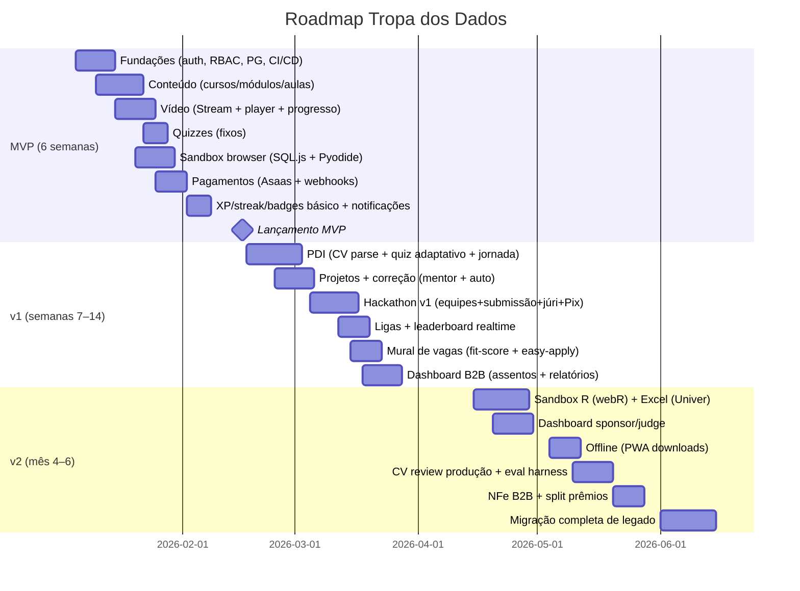

# Tropa dos Dados — Especificação Técnica de Arquitetura

**Status:** baseline de referência para engenharia (source of truth)
**Versão:** 1.0 — v0.1 (MVP) a v2
**Escopo:** plataforma própria de educação em dados (substitui Cakto/Hotmart), multiaudência (B2C, B2B empresas, instituições, patrocinadores/jurados de hackathon).

---

## 0. Decisões executivas (TL;DR)

| Decisão | Escolha | Por quê |
|---|---|---|
| Arquitetura | **Monólito modular** (1 repo, 3 processos) | velocidade de entrega + robustez; escala horizontal por processo |
| Web | **Next.js 15 (App Router) + React 19 + TS**, PWA | SSR/ISR para marketing e SEO, Server Components reduzem JS, ecossistema maduro |
| Backend | **NestJS (Fastify adapter)** + workers BullMQ | DI, módulos, gateways WebSocket, `@nestjs/bullmq`; domínio rico (pagamentos, PDI, gamificação) |
| Banco | **PostgreSQL 16** (gerenciado) + **Prisma** | schema como código, migrations, raw SQL para query complexa |
| Realtime | **Socket.IO + Redis adapter** | leaderboards ao vivo, eventos de sandbox, notificações; escala horizontal barata |
| Fila/Cache | **Redis (BullMQ + cache + rate limit)** | um único serviço resolve fila, cache e líderes |
| Vídeo | **Cloudflare Stream** (upload TUS → transcode → HLS/MP4 + player + assinatura de URL) | $5/1.000 min armazenados + $1/1.000 min entregues, encoding grátis, sem egress; previsível |
| Objeto/CDN | **Cloudflare R2 + Cloudflare CDN** | S3-compatível, egress $0, mesmo fornecedor do vídeo |
| Sandbox learning | **WASM no browser**: SQL.js/DuckDB-WASM, Pyodide (Python), webR (R), Univer (Excel) | custo ~zero, feedback instantâneo, sem server por execução |
| Sandbox grading | **Servidor isolado**: **Modal Sandboxes** (gVisor) no início, **e2b** (Firecracker) se volume alto, **K8s+gVisor** no estágio D | segurança real para código não confiável, custo por segundo |
| Pagamentos | **Asaas** como PSP via **camada de abstração própria** (entitlements/planos/cupons nossos) | Pix + cartão + boleto + assinatura + split (para premiação) numa API BR, sem PCI scope |
| Auth | **Auth.js (NextAuth) v5** + credenciais + JWT + sessão em Postgres | LGPD (dados em BR), controle de roles, custo zero por MAU |
| AI | **Camada proxy própria** (OpenAI primary + Gemini fallback) com Structured Outputs (JSON Schema) | custo controlável, PT-BR, guardrails LGPD, fallback determinístico |
| Monitoramento | **Sentry + OpenTelemetry → Grafana Cloud (LGTM)** | erro e traço num só lugar, barato no início |

---

## 1. Arquitetura Geral

### 1.1 Recomendação: Monólito Modular

**Não use microservices agora.** Microservices pagam um custo de infraestrutura, observabilidade e release que você ainda não tem "receita" para pagar. Monólito único (tudo num repo) + módulos de domínio claros (Payments, Gamification, Sandbox, PDI, Content, Jobs, Hackathon) + **fronteiras físicas em 3 processos** permite escalar o que precisa quando precisar, sem reescrever.

```
┌──────────────────────────────────────────────────────────────────────┐
│                         MONÓLITO MODULAR (1 repo)                      │
│                                                                        │
│  ┌──────────────┐   ┌─────────────────────────────┐   ┌─────────────┐  │
│  │  app-web     │   │  app-api (NestJS/Fastify)    │   │ app-worker  │  │
│  │ Next.js 15   │──▶│  Auth · Payments · PDI ·    │   │ (BullMQ)    │  │
│  │ SSR + PWA    │   │  Gamification · Jobs ·      │──▶│ leagues ·   │  │
│  │ Server/Route │   │  Sandbox· Realtime gateway  │   │ streaks ·   │  │
│  │  Handlers    │   │  (Socket.IO)                │   │ emails ·    │  │
│  └──────────────┘   └─────────────────────────────┘   │ grading ·   │  │
│         │                          │                   │ video cb ·  │  │
│         │                          │                   │ AI queue    │  │
│         └──────────────────────────┼───────────────────┘             │
│                                    ▼                                 │
│                        ┌───────────────────────┐                     │
│                        │  Postgres 16 + Redis  │                     │
│                        └───────────────────────┘                     │
└──────────────────────────────────────────────────────────────────────┘
        ▲                    ▲                         ▲
        │                    │                         │
   Cloudflare CDN       Cloudflare Stream        R2 (arquivos, datasets,
   (estático+API edge)  (vídeos, HLS/MP4)         CVs, submissões)
```

**Por que 3 processos e não 1?**
- **Webhooks (Asaas, Cloudflare Stream)**: precisam de endpoints estáveis, não-serverless, com fila.
- **Workers**: job de settlement de ligas, dunning, grading — não podem morrer com cold start.
- **Gateway realtime**: conexão longa separada do request/response.
- Tudo comparte **um mesmo domínio/código** (módulos NestJS reutilizados entre `api` e `worker`).

**Deploy:** container único por processo em **Railway** (Primary — 3 serviços `web`/`api`/`worker` + plugins gerenciados de Postgres 16 e Redis, rede privada `.railway.internal`; GitHub Actions → Dockerfile por serviço). Fly.io como alternativa de fallback. Em estágio D, Kubernetes (GKE/EKS ou DigitalOcean) só se a equipe tiver operador dedicado — senão, continue no PaaS com réplicas. Regra: webhook endpoints e `app-worker` usam **Service sempre ativo** (nunca serverless); estado efêmero fora do disco (uploads → R2, filas → Redis, DB → plugin).

### 1.2 Stack detalhada

| Camada | Tecnologia | Rationale |
|---|---|---|
| Web | Next.js 15 App Router, React 19, TypeScript strict | SSG p/ marketing, ISR p/ catálogo, PWA (service worker + IndexedDB) |
| API | NestJS 11 + Fastify adapter | ~2x mais rápido que Express; DI e módulos |
| ORM | Prisma + `pglite` para scratch | schema.md como fonte; escape hatch com raw SQL |
| DB | PostgreSQL 16 gerenciado | criptografia, backups, PITR; no estágio C réplica de leitura |
| Pool | PgBouncer (transaction pooling) | aguentar sockets abertos (Socket.IO + long poll) sem estourar conexões |
| Cache/Fila | Redis 7 (self-host ou Upstash) | cache, BullMQ, rate limit, sorted sets p/ ranking |
| Realtime | Socket.IO + `@socket.io/redis-adapter` | broadcast em múltiplos nós |
| Objeto | Cloudflare R2 (S3 API) | egress $0 — crítico para vídeo/datasets no Brasil |
| Vídeo | Cloudflare Stream | ver §4 |
| E-mail | Resend (API) + templates React-Email | barato, PT-BR, tracking de abertura |
| Push | FCM/APNs via Expo Notifications | PWA + Android em um SDK |
| Observabilidade | Sentry + OpenTelemetry + Grafana Cloud (Loki/Prometheus/Tempo) | 1 painel, free tier generoso |
| CI/CD | GitHub Actions + Docker | lint + typecheck + tests + migrate + deploy |
| Feature flags | Tabela própria + SDK leve (ou PostHog) | corte de rollout sem deploy |
| Analytics de produto | PostHog (cloud) | funis, retenção, A/B de onboarding |

### 1.3 Auth e Roles

- **Auth.js v5** com provider **credentials** + adapter Prisma. Hash com **Argon2id** (não bcrypt — nativo, resistente a GPU). Sessão: **JWT curto (15 min) + refresh token opaco (30 dias)** em cookie httpOnly, rotação de refresh, revogação por dispositivo.
- Roles implementadas em **`user_roles` (M2M)** — um usuário pode ser `student` e `judge` e `mentor` ao mesmo tempo.

| Role | Pode |
|---|---|
| `student` | assinatura, trilhas, sandbox, submissões, mural de vagas |
| `mentor` | corrigir projetos (nota/feedback), responder dúvidas |
| `admin` | tudo (conteúdo, planos, usuários, relatórios) |
| `company_admin` | painel B2B: assentos, progresso da equipe, relatórios |
| `sponsor` | criar/patrocinar hackathon, definir premiação, ver métricas |
| `judge` | acessar submissões do hackathon e pontuar |

**Contratos:** RBAC via guards NestJS + middleware Next; isolamento multi-tenant (empresas) via escopo `org_id` em cada query (policy por tenant no Prisma). **Nunca confie em role do JWT para autorização sensível — sempre consultar DB** (revogação imediata).

### 1.4 LGPD (visão geral; detalhes em §8)

- **Base legal:** contrato (execução de serviço) + legítimo interesse (segurança/anti-fraude) + consentimento específico para marketing. Consentimentos versionados e gravados.
- **DPO, DPA com fornecedores** (Cloudflare, Asaas, OpenAI, Resend), **DPIA** para PDI/CV (dados sensíveis).
- Dados pessoais de brasileiros ficam preferencialmente no Brasil (Asaas, banco); onde não for possível (Cloudflare CDN/R2, LLMs), **cláusulas contratuais padrão + avaliação de impacto**.
- **API de direitos do titular (exportar/excluir em 15 dias), retenção por finalidade, anonimização** — detalhado em §8.

---

## 2. Modelo de Dados

### 2.1 Princípios

- **UUID v7** como PK (ordenado por tempo, amigável a índice).
- **Soft delete** (`deleted_at`) em entidades de conteúdo e usuário; **hard delete físico** só via job de expurgo pós-prazo LGPD.
- **Apenas auditoria em `audit_logs`**; eventos de XP append-only.
- Timestamps `created_at/updated_at`; datas de timezone do usuário em `profiles.timezone`.
- Números monetários em **centavos (integer)**; evite `float`.

### 2.2 Diagrama ER (mermaid)

```mermaid
erDiagram
    users ||--o| profiles : has
    users ||--o{ user_roles : has
    users ||--o{ company_memberships : belongs
    organizations ||--o{ company_memberships : has
    plans ||--o{ subscriptions : defines
    users ||--o{ subscriptions : pays
    coupons ||--o{ coupon_redemptions : used_in
    subscriptions ||--o{ coupon_redemptions : gets
    subscriptions ||--o{ payments : generates
    subscriptions ||--o{ transactions : ledger
    courses ||--o{ modules : contains
    modules ||--o{ lessons : contains
    lessons ||--o{ lesson_requires : depends
    lessons ||--o{ video_assets : streams
    video_assets ||--o| transcripts : has
    users ||--o{ notes : writes
    users ||--o{ lesson_progress : tracks
    lessons ||--o{ quizzes : has
    quizzes ||--o{ quiz_questions : contains
    users ||--o{ quiz_attempts : makes
    quiz_attempts ||--o{ user_question_answers : detail
    lessons ||--o{ sandboxes : has
    datasets ||--o{ sandbox_datasets : linked
    sandboxes ||--o{ sandbox_datasets : linked
    users ||--o{ sandbox_sessions : runs
    sandbox_sessions ||--o{ sandbox_events : logs
    lessons ||--o{ projects : has
    users ||--o{ project_submissions : submits
    project_submissions ||--o{ project_grades : graded_by
    skill_taxonomy ||--o{ skill_taxonomy : parent
    skill_taxonomy ||--o{ skill_scores : measured
    users ||--o{ skill_scores : has
    users ||--o{ xp_events : earns
    users ||--o| user_xp : totals
    users ||--o| streaks : has
    badges ||--o{ user_badges : earned_by
    leagues ||--o{ league_rankings : ranks
    users ||--o{ league_rankings : participates
    users ||--o{ notifications : receives
    users ||--o{ devices : register
    organizations ||--o{ jobs : posts
    jobs ||--o{ job_applications : receives
    users ||--o{ job_applications : applies
    users ||--o{ cvs : uploads
    cvs ||--o{ cv_reviews : reviewed_by
    users ||--o{ pdi_plans : owns
    pdi_plans ||--o{ pdi_nodes : builds
    pdi_nodes ||--o{ pdi_nodes : parent
    organizations ||--o{ hackathons : sponsors
    hackathons ||--o{ hackathon_prizes : awards
    hackathons ||--o{ hackathon_teams : has
    hackathon_teams ||--o{ hackathon_team_members : composed
    hackathons ||--o{ hackathon_submissions : receives
    hackathons ||--o{ hackathon_judges : assigned
    hackathon_submissions ||--o{ hackathon_scores : scored_by
    users ||--o{ certificates : gets
    users ||--o{ audit_logs : acts
```



### 2.3 Entidades e colunas-chave

**Identidade e acesso**
- `users`: `id (uuid)`, `email (unique)`, `password_hash`, `name`, `avatar_url`, `status (active/suspended/deleted)`, `created_at`, `updated_at`, `deleted_at`
- `profiles`: `user_id (FK)`, `headline`, `bio`, `timezone` (IANA), `learning_style (visual/auditivo/leitura/pratico)`, `career_goal`, `linkedin_url`, `github_url`, `consent_marketing_at`, `consent_terms_version`, `data_export_token`, `data_deletion_requested_at`
- `user_roles`: `user_id`, `role (enum)`, `scopes (jsonb)`, `organization_id (nullable)` — role por escopo de org (ex.: `judge` só para um hackathon)
- `sessions`: `user_id`, `refresh_token_hash`, `device_meta (jsonb)`, `expires_at`, `revoked_at`

**Organizações (B2B/instituição/patrocinador)**
- `organizations`: `id`, `name`, `cnpj`, `type (company/institution/sponsor)`, `plan_id`, `billing_email`
- `company_memberships`: `user_id`, `organization_id`, `role (admin/manager/member)`, `seat_active`, `seat_expires_at`

**Planos, assinaturas, pagamentos**
- `plans`: `code`, `name`, `type (b2c_monthly/b2c_annual/b2b_seats/institution)`, `price_cents`, `billing_cycle`, `features (jsonb: sandbox_hours, seats, certificates, mentor_access)`, `xps_multiplier`
- `subscriptions`: `user_id` **ou** `organization_id`, `plan_id`, `provider (asaas)`, `provider_subscription_id`, `status (trialing/active/past_due/canceled)`, `trial_ends_at`, `period_start`, `period_end`, `cancel_at`, `seats_used`
- `payments`: `subscription_id`, `provider_payment_id`, `amount_cents`, `status (pending/paid/failed/refunded/chargeback)`, `method (pix/card/boleto)`, `installments`, `due_date`, `paid_at`, `receipt_url`
- `transactions`: ledger financeiro — `type (revenue/fee/refund/prize_payout)`, `amount_cents`, `net_cents`, `provider_meta (jsonb)`, `status`
- `coupons`: `code`, `type (percent/fixed/month_free)`, `value`, `max_uses`, `expires_at`, `stackable (bool)`
- `coupon_redemptions`: `coupon_id`, `subscription_id`, `used_at`

**Conteúdo**
- `courses`: `slug`, `title`, `description`, `cover_url`, `level`, `status (draft/published/archived)`, `xp_total`, `author_id`, `published_at`
- `modules` (missões): `course_id`, `title`, `position`, `type (watch/do/play)`, `estimated_minutes`, `xp_award`, `unlock_xp`
- `lessons`: `module_id`, `title`, `position`, `type (video/article/sandbox/quiz/project/challenge)`, `content (jsonb)`, `duration_seconds`, `xp_award`
- `lesson_requires`: `lesson_id`, `requires_lesson_id` (pré-requisitos, grafo de desbloqueio)
- `video_assets`: `lesson_id`, `provider (cloudflare_stream)`, `provider_uid`, `status (processing/ready/error)`, `hls_url`, `mp4_url`, `duration`, `renditions (jsonb)`, `watermark (bool)`, `storage_minutes`, `captions (jsonb)`
- `transcripts`: `video_asset_id`, `lang`, `text (fulltext)`, `sentences (jsonb)`, `ts_vector (tsvector)` — busca em vídeo
- `notes`: `user_id`, `lesson_id`, `content`, `created_at` — anotações pessoais com `searchable (tsvector)`

**Progresso**
- `lesson_progress`: **UNIQUE (user_id, lesson_id)**; `status (started/completed)`, `watched_seconds`, `last_position_seconds`, `completed_at`

**Quizzes**
- `quizzes`: `lesson_id`, `mode (adaptive/fixed)`, `passing_score`, `time_limit_seconds`, `shuffle`, `xp_award`, `max_attempts`
- `quiz_questions`: `quiz_id`, `prompt`, `options (jsonb)`, `correct_index`, `difficulty (1..5)`, `skill_id`, `explanation`, `category`
- `quiz_attempts`: `quiz_id`, `user_id`, `started_at`, `finished_at`, `score`, `earned_xp`, `adaptive_state (jsonb)` — vetor de theta (IRT)
- `user_question_answers`: `attempt_id`, `question_id`, `chosen_index`, `correct (bool)`, `time_ms`

**Sandbox (browser + server)**
- `sandboxes`: `lesson_id (nullable)`, `title`, `engine (sql/python/r/excel)`, `spec (jsonb: datasets, setup, prompt, hidden_tests)`, `difficulty`, `xp_award`, `max_server_seconds`
- `datasets`: `name`, `storage_key (R2)`, `format (csv/parquet/sqlite)`, `rows`, `schema (jsonb)`, `size_bytes`, `license`
- `sandbox_datasets`: `sandbox_id`, `dataset_id`
- `sandbox_sessions`: `user_id`, `sandbox_id`, `engine_session_id`, `status`, `cells (jsonb)`, `last_active_at`
- `sandbox_events`: `session_id`, `type (run/copy/paste/navigate)`, `payload (jsonb)`, `created_at` — append-only, usado p/ anti-cheat e auditoria

**Projetos (correção)**
- `projects`: `module_id`, `title`, `brief_md`, `acceptance_criteria (jsonb)`, `evaluation_mode (auto/mentor/hybrid)`, `grading_tests (jsonb)`, `rubric (jsonb)`, `xp_award`
- `project_submissions`: `project_id`, `user_id`, `status`, `artifacts (jsonb: keys R2)`, `score`, `earned_xp`, `submitted_at`
- `project_grades`: `submission_id`, `grader (auto/mentor/ai)`, `grader_user_id (nullable)`, `score`, `rubric_scores (jsonb)`, `feedback_md`, `graded_at`

**Skill/PDI**
- `skill_taxonomy`: `name`, `slug`, `parent_id` (árvore), `category (sql/python/r/excel/estatistica/ml/soft)`, `level_max (S0..S5)`, `description`
- `skill_scores`: **UNIQUE (user_id, skill_id)**; `level (0..5)`, `confidence`, `last_assessed_at`, `source (quiz/pdi/sandbox/hackathon)`
- `cvs`: `user_id`, `filename`, `storage_key`, `mime`, `parse_status`, `parsed (jsonb)`, `is_current`, `created_at`
- `cv_reviews`: `cv_id`, `status`, `overall_score`, `summary_md`, `sections (jsonb: pontuação/feedback por seção)`, `ats_score`, `strengths (jsonb)`, `improvements (jsonb)`, `model`, `cost_cents`, `generated_at`
- `pdi_plans`: `user_id`, `version`, `status (draft/active/completed)`, `objective`, `source (jsonb: cv_id, quiz_ids, learning_style)`
- `pdi_nodes`: `pdi_plan_id`, `parent_id`, `type (milestone/skill/course/project/hackathon)`, `title`, `skill_id`, `recommended_content (jsonb)`, `estimated_weeks`, `order_index`, `status (todo/in_progress/done)`, `progress`

**Gamificação**
- `xp_events`: `user_id`, `type (lesson_complete/quiz_pass/sandbox_complete/project_graded/streak_day/hackathon/badge/daily_login/referral)`, `source_id`, `amount`, `created_at`, **`unique_key (unique)`** — idempotência
- `user_xp`: **UNIQUE (user_id)**; `total_xp`, `week_xp`, `week_start`, `level`
- `streaks`: `user_id`, `current`, `longest`, `last_activity_date (date)`, `freezes_available`, `freezes_used`, `timezone`
- `badges`: `code`, `name`, `description`, `icon`, `criteria (jsonb)` — condição declarativa
- `user_badges`: **UNIQUE (user_id, badge_id)**; `progress (jsonb)`, `earned_at`
- `leagues`: `season`, `week_start`, `week_end`, `status (open/settling/settled)`, `cohort_size`, `promotion_count`
- `league_rankings`: **UNIQUE (league_id, user_id)**; `xp`, `rank`, `eligible_promotion (bool)`

**Notificações**
- `notifications`: `user_id`, `type`, `channel (in_app/push/email)`, `title`, `body`, `data (jsonb)`, `read_at`, `sent_at`
- `devices`: `user_id`, `platform`, `push_token`, `topics (jsonb)`
- `notification_prefs`: `user_id`, `category`, `channel`, `enabled`

**Mural de vagas**
- `jobs`: `organization_id`, `title`, `description`, `requirements (jsonb)`, `location`, `work_mode`, `salary_min/max`, `seniority`, `skills (jsonb: [{skill_id, level}])`, `status`, `posted_at`, `closes_at`
- `job_applications`: `job_id`, `user_id`, `status`, `fit_score (0..100)`, `cv_snapshot (jsonb)`, `answers (jsonb)`, `applied_at`, `employer_viewed_at`

**Hackathon**
- `hackathons`: `sponsor_org_id`, `title`, `theme`, `rules_md`, `start_at`, `end_at`, `submission_deadline`, `status (draft/open/running/judging/closed)`, `prize_pool_cents`, `judging_criteria (jsonb)`, `max_team_size`, `xp_multiplier`
- `hackathon_prizes`: `hackathon_id`, `position`, `amount_cents`, `description`
- `hackathon_teams`: `hackathon_id`, `name`, `leader_user_id`
- `hackathon_team_members`: `team_id`, `user_id`, `role`, `joined_at`
- `hackathon_submissions`: `hackathon_id`, `team_id (nullable)`, `user_id`, `title`, `repo_url`, `demo_url`, `storage_keys`, `submitted_at`, `status (submitted/shortlisted/winner)`
- `hackathon_judges`: `hackathon_id`, `user_id`, `scope (jsonb)`
- `hackathon_scores`: **UNIQUE (submission_id, judge_id)**; `criteria_scores (jsonb)`, `total_score`, `feedback_md`, `scored_at`

**Certificados**
- `certificates`: `user_id`, `course_id (nullable)`, `hackathon_id (nullable)`, `serial (unique)`, `issued_at`, `verify_url`, `pdf_key`, `status`

**Auditoria**
- `audit_logs`: `actor_user_id`, `action`, `resource_type`, `resource_id`, `before (jsonb)`, `after (jsonb)`, `ip`, `user_agent`, `created_at`

### 2.4 Índices críticos (resumo; completar em §9)

- UNIQUE em: `users.email`, `lesson_progress(user_id, lesson_id)`, `skill_scores(user_id, skill_id)`, `xp_events.unique_key`, `league_rankings(league_id, user_id)`, `hackathon_scores(submission_id, judge_id)`
- `xp_events(user_id, created_at)` e `xp_events(created_at)` (BRIN para varredura por período)
- `payments(subscription_id, due_date)`, `subscriptions(status)`
- `notifications(user_id, read_at)` parcial (WHERE read_at IS NULL)
- `jobs(organization_id, status)`, `job_applications(job_id, status)`
- FTS: `transcripts.ts_vector`, `lessons` e `courses` com `pg_trgm` para busca de conteúdo

---

## 3. Sandbox Engine (a parte mais difícil)

### 3.1 Visão geral — híbrido

```
┌────────────────────────  APRENDIZADO (browser)  ─────────────────────────┐
│  SQL.js / DuckDB-WASM  ·  Pyodide  ·  webR  ·  Univer (Excel)            │
│  ~zero custo server · feedback <1s · funciona offline (PWA)              │
│  Datasets via CDN (R2 + Cloudflare) com ETag/immutable                   │
└──────────────────────────────────────────────────────────────────────────┘
                    │ submit (assinado) │
                    ▼
┌──────────────────────────  AVALIAÇÃO (servidor)  ────────────────────────┐
│  Modal Sandbox (gVisor) → e2b (Firecracker) → K8s+gVisor no estágio D    │
│  roda hidden tests / corrige projeto / verifica anti-cheat               │
│  limites: 1 vCPU · 1–2 GiB RAM · timeout 30s/5min · rede bloqueada       │
└──────────────────────────────────────────────────────────────────────────┘
```

**Regra de ouro:** o browser roda **o código do aluno para ele aprender**; o servidor roda **o código do aluno para a plataforma confiar**. Nunca o inverso.

### 3.2 Opções avaliadas

| Opção | Prós | Contras | Veredito |
|---|---|---|---|
| (a) 100% browser (SQL.js, Pyodide, webR) | custo ~0, latência, offline | avaliação confiável, anti-cheat frágil, webR ~100–150 MB de download, limitado a 2 GB WASM | **base da camada de aprendizado** |
| (b) 100% server (containers/gVisor/Firecracker) | controle total, grade confiável | custo por execução, latência, infra pesada | **não para o loop de aprendizado** |
| (c) Híbrido | melhor dos dois | complexidade de 2 caminhos | **RECOMENDADO** |

### 3.3 Runtimes por linguagem (browser)

| Runtime | Engine | Tamanho inicial | Pacotes | Observações |
|---|---|---|---|---|
| SQL | **DuckDB-WASM** (ou SQL.js p/ SQLite) | ~1–3 MB core | — | DuckDB lê **Parquet direto do CDN via HTTP** → datasets grandes sem carregar tudo; recomendado |
| Python | **Pyodide** | ~15 MB core; numpy/pandas/matplotlib incl. | micropip (pure-Python wheels) | roda em Worker; cuidado com 2 GB de memória WASM; paginar datasets |
| R | **webR** | ~60–100 MB | ~10.4k pacotes WASM (repo.r-wasm.org) | carregar **lazy** com loader de progresso; fallback server se browser fraco |
| Excel | **Univer** (sucessor do Luckysheet, open-source, ativo) | ~1–3 MB | — | fórmulas no client via motor próprio; exportar `.xlsx`; alternativa: x-spreadsheet |

**Detalhes de arquitetura browser:**
- Tudo roda em **Web Worker** dedicado (main thread livre) + `SharedArrayBuffer` quando disponível (cross-origin isolation: `COOP/COEP` no Next).
- **Datasets**: empacotados como assets imutáveis em R2 (URL com hash) e **pré-cacheados pelo Service Worker** (PWA). Sem isso, cada abertura = re-download.
- **Persistência de sessão**: células/estado em IndexedDB (por `sandbox_session_id`), sincronizadas de forma lazy (dirty-marking) com a API. Se perder a sessão, o estado ressurge.
- **Limite de recurso browser**: watchdog de tempo por `run` (ex.: 20s), captura de `console`/`stdout`/plots, bloqueio de `fetch` fora de allowlist de datasets (CSP) — sandbox WASM já isola memória, mas queremos limitar loops infinitos.

### 3.4 Runner servidor (grading/submissão)

| Fornecedor | Isolamento | Preço | Melhor para |
|---|---|---|---|
| **Modal Sandboxes** | gVisor | US$ 0,00003942/core·s + 0,00000672/GiB·s, **$30/mês de crédito Starter, sem piso** | **início** — custo ~zero em MVP, tempo por segundo |
| **e2b** | Firecracker (microVM) | ~US$ 0,10/h (2 vCPU); piso US$ 150/mês Pro | alto volume contínuo de execuções interativas |
| K8s + gVisor/Firecracker próprios | forte | custo de infra/ops | estágio D (100k usuários), com equipe dedicada |

**Contrato de execução (job de grading):**
1. Recebe: `sandbox_id`, `submission_artifacts`, `hidden_tests`, `dataset_keys`, `user_id`
2. Monta imagem imutável (Python 3.12 + pandas/numpy/sqlite3 + `r-base` + `openpyxl`) com camadas de dataset cacheadas
3. Executa com: **1 vCPU · 1–2 GiB RAM · timeout 30s (interativo) / 5 min (grade)** · rede **bloqueada** · fs efêmero
4. Grava: `project_grades` ou `sandbox_events` + resultado assinado
5. Anti-cheat: comparação de similaridade (token-based, estilo MOSS) com as N últimas submissões do mesmo projeto/hackathon; corrida de `--` por hash de código (sementes); reexecução das submissões vencedoras do hackathon

**Custo estimado por usuário ativo:**
- Browser: **R$ 0,00–0,05/mês** (só banda de dataset; ~50–200 MB por curso, CDN + cache).
- Server: 1k usuários ativos × 5 submissões/mês × ~10s/execução (1 core) ≈ 14 h core/mês ≈ **US$ 2/mês no Modal** — irrelevante. O pico real é o **hackathon** (final: milhares de submissões em 48h) — para isso: pool de réplicas pré-aquecidas + rate limit por time (ex.: 3 submissões/h).

**Mitigação de abuso/cheating:**
- Rate limit: `X submissões/hora` e `Y runs/minuto` por usuário (config por plano).
- Cap diário de XP por atividade sandbox.
- `sandbox_events` (copy/paste/navigate/run) como evidência para revisão manual de suspeitos.
- Bloqueio de rede do aluno (só datasets allowlist) — evita "gabarito via fetch".
- Submissão assinada com nonce + HMAC para impedir replay.

---

## 4. Pipeline de Vídeo

### 4.1 Decisão: Cloudflare Stream (não self-hosted)

| Critério | Cloudflare Stream | Mux | Self-host (FFmpeg + R2) |
|---|---|---|---|
| Custo | $5/1k min armazenados + $1/1k min entregues; **encoding/ingest grátis; sem egress** | ~$0,003/min·mês armazenado + ~$0,0008–0,0048/min entregue (por resolução) | só infra, mas OPS enorme (encoding, renditions, packaging, DRM) |
| Operação | API + player + analytics + thumbnails | ótimo analytics, player | você constrói tudo |
| DRM | não nativo | sim (add-on) | você constrói |
| Veredito | **ESCOLHA** (previsível, $ mínimo $5/mês) | alternativa p/ estágio D se precisar de Mux Data | rejeitado — custo de time alto |

**Fluxo:**
```
Creator (estúdio) → upload TUS (resumable, até 30 GB) → Direct Creator Upload
        → Cloudflare Stream (transcode: 360p/480p/720p/1080p HLS+MP4)
        → webhook `video.ready` → job valida, grava video_assets, publica lesson
        → transcripts/captions (IA da CF ou nosso Whisper) → notas → catálogo
```

### 4.2 Anti-pirataria (recomendação por camada)

1. **URLs assinadas** (expiração curta, por usuário) — obrigatório sempre.
2. **Watermark** de identificação por usuário (Cloudflare Stream Watermark API) — deterrência e rastreabilidade.
3. **DRM completo (Widevine/FairPlay)** — **adiar**. Só se houver vazamento real comprovado de conteúdo premium. Custo/operação altos; para curso gravado, signed URL + watermark resolve 95% do caso.
4. Player customizado (sem controles públicos de rede): via API/eventos do player Stream, com domínio de origem validado.

### 4.3 Offline (PWA) e progresso

- **Download offline**: item "baixar aula" → MP4 (gerado pelo Stream) assinado com token curto + **limite por dispositivo** (ex.: 5 aulas simultâneas, expira em 30 dias, revogável). Guardar no **IndexedDB/OPFS**.
- **Progresso com retomada**: heartbeats a cada 10s (`watched_seconds`, `last_position_seconds`), batched em 1 POST/min, deduplicado por `lesson_progress`. UI "continuar de 3:42" na trilha.
- **Transcrições + capítulos + notas**: busca fulltext em `transcripts`, clicar em trecho → seek no player; notas com `@timestamp`.

### 4.4 Modelo de custo (R$) e controle

Cenário típico: 1.000 usuários ativos, 100 h de conteúdo novo/mês, média 20 min assistidos por aula ativa, 3 aulas/semana/usuário.

| Item | Cálculo | US$/mês |
|---|---|---|
| Armazenamento | 6.000 min × $5/1.000 | $30 |
| Entrega | 1.000 ua × 3 aulas/sem × 20 min × 4,33 = 260k min × $1/1.000 | $260 |
| **Total** | | **~$290/mês** |

**Caps e mitigação:**
- Teto por curso (horas) e alerta de orçamento por mês (worker de `video_assets` + custo estimado).
- **Rendition baixa por padrão** (720p) e resolução adaptativa; aulas de exercício podem ser 480p.
- **Estimador de custo** no admin (por upload e por mês projetado).
- Se a conta de delivery passar de ~US$ 1k/mês, reavaliar Mux (billing por segundo, cold storage até −60%) e/ou Bunny Stream.

---

## 5. Gamificação + Realtime

### 5.1 Sistema de XP (ledger idempotente)

**Regra de ouro:** `xp_events` é a fonte de verdade; `user_xp` é agregação derivada.

```
Evento (lesson_complete, quiz_pass, ...) 
  → valida regras (plan, cap diário) → INSERT xp_events (unique_key)
  → ON CONFLICT DO NOTHING (idempotência)
  → job atualiza user_xp (total, week_xp) → verifica badges → verifica streak → publica notificação
```

- `unique_key = "<type>:<user_id>:<source_id>"` — impede duplicação de retry/replay.
- **Caps anti-abuso** (por plano): cap diário de XP (ex.: 300/dia), 1 `daily_login`/dia, replay de quiz só conta a melhor tentativa, sandbox só credita a 1ª execução correta por exercício.
- **Badges**: critérios declarativos em JSON (`{type:"and", ops:[{xp_total: 1000}, {streak: 30}]}`) avaliados pelo worker após cada evento.

### 5.2 Streaks (timezone-aware, DST-safe)

- Coluna `profiles.timezone` (IANA). Cálculo do "dia do usuário": `CURRENT_DATE AT TIME ZONE tz`.
- `streaks.last_activity_date` guarda **date no fuso do usuário** (nunca UTC) → imune a DST (Brasil tem DST em poucos estados; a coluna date evita viés).
- Atualização: job noturno (UTC) percorre streaks ativas; se `last_activity_date < hoje-1` e há freeze disponível → aplica freeze; senão zera.
- **Freeze**: 2 por trimestre (configurável), não acumula, UI clara de "use seu escudo".

### 5.3 Ligas (buckets semanais)

- **Cohort**: 30–50 usuários. Associação por ranqueamento de XP da semana (janela **Seg 00:00 UTC a Dom 23:59:59 UTC**; considere "semana brasileira" = Seg–Dom).
- **Settlement** (worker): promove top 15% (ligas acima), demove bottom 15% (ligas abaixo), novatos ficam na liga atual 1 semana. Ligas com bots placeholder para completar cohort (nomes gerados, XP fixo) — evita ligas vazias.
- `league_rankings` atualizada a cada hora (agregado de `xp_events` via janela) + **scoreboard ao vivo** por Socket.IO.

### 5.4 Realtime (WebSocket)

```
Socket.IO (gateway no app-api)
 ├─ rooms: user:{userId} (notificações + XP em tempo real)
 ├─ rooms: league:{leagueId} (rankings ao vivo)
 ├─ rooms: hackathon:{hackathonId} (placar, eventos de submissão)
 └─ Redis adapter (scale horizontal)
Publicação: fluxos escrevem em Redis (BullMQ) → gateway faz broadcast → cliente atualiza UI otimista
```

- **Escala:** socket é stateless entre nós graças ao Redis adapter; conexão única por usuário (multisocket com `connection_state_recovery`).
- **Fallback:** se WebSocket falhar (rede corporativa), polling leve de 30s no `GET /v1/leagues/:id/rank`.

### 5.5 Notificações

| Canal | Quê | Cadência |
|---|---|---|
| in-app (socket + DB) | XP, streak, league, badge, quiz corrigido, submissão | imediato |
| Push (FCM/APNs) | streak em risco, vaga compatível, hackathon começando, resultado | imediato p/ 2 primeiros; resto digest diário |
| Email (Resend) | confirmação de inscrição/pagamento, dunning, relatório semanal de progresso (B2B) | transacional imediato + digest **segunda 8h BRT** |

- Preferências por categoria/canal em `notification_prefs`; anti-spam (max 1 push de marketing/dia, opt-in).

---

## 6. PDI + Serviços de IA

### 6.1 Arquitetura: proxy próprio (não chamadas espalhadas)

```
┌─ app-api: módulo AI ──────────────────────────────────────────┐
│  roteador por tarefa (model routing)                          │
│  ├─ CV parse:  Gemini Flash (barato)  → JSON Schema → zod     │
│  ├─ CV review: Claude Sonnet / GPT-4.1-mini  → JSON Schema    │
│  ├─ PDI:       Claude Sonnet → JSON Schema (grafo)            │
│  ├─ Quiz adaptativo: matemática local (IRT 1PL), LLM só p/    │
│  │   gerar distratores/explanações em lote (worker)           │
│  └─ Feedback de projeto: GPT-4.1-mini → rubric JSON           │
│  guardrails: PII redaction → allowlist → structured outputs   │
│  cache: hash do input → reuse · prompt caching · fallback     │
│  egress: fila BullMQ (AI queue) · retry/backoff · circuit      │
│  breaker · budget por usuário/dia                             │
└────────────────────────────────────────────────────────────────┘
```

**Escolha de modelo:** OpenAI primary (Structured Outputs/JSON Schema + `response_format` maduro) + **Google Gemini como fallback e para tarefas bulk baratas** (CV parse). Anthropic como opção para PDI de alta qualidade. Abstração via interface única (`AiProvider`): `complete(task, input, schema)`.

### 6.2 Fluxos

**CV parsing (estruturado):**
1. Upload → validação (magic bytes, ≤10 MB, PDF/DOCX) → **ClamAV** → texto via `pdfjs`/`mammoth` no worker.
2. **Redação de PII** (regex + NER local: e-mail, CPF, telefone, endereço) antes de enviar ao LLM — LGPD.
3. LLM retorna JSON conforme schema (`experiencia`, `skills[]`, `educacao[]`, `projetos[]`) → valida com **zod** → salva `cvs.parsed`.
4. Fallback determinístico (regex/template) se API fora — o review fica "avaliável" mesmo offline.

**CV review (score + feedback):**
- Score 0–100 por rubrica fixa (formato, impacto, palavras-chave, senioridade) + seções com feedback PT-BR.
- **Cache:** hash do conteúdo do CV + versão da rubrica → reuso por 30 dias (sem re-billing).
- **Eval harness:** golden set de 50 CVs com score esperado; CI roda e exige delta ≤5 pontos vs baseline; se regredir, bloqueia release da rubrica.

**PDI (jornada):**
1. Entrada: `cvs.parsed` + resultado do **quiz adaptativo** + `learning_style`.
2. Monta **vetor de skill** (skill_scores). Gap = alvo de carreira (perfil) − vetor atual.
3. Template de trilha por alvo (ex.: "Analista de Dados Sênior") + LLM ordena nós = **grafo** de `pdi_nodes` (milestones → skills → cursos → projetos → hackathons) mapeados a conteúdo real da plataforma.
4. `pdi_plans.status=active`; cada nó alimenta recomendações na home ("sua missão da semana").

**Quiz adaptativo (IRT 1PL):** θ estimado por atualização Bayesiana simples; próxima pergunta escolhida por **Fisher information máximo** no banco de questões; dificuldade inicial = skill_scores. LLM **não** participa do runtime do quiz (latência/custo) — só gera itens em lote.

### 6.3 Guardrails, LGPD e custo

- **PII:** redação automática antes de qualquer request; política de "não incluir dados pessoais no feedback"; logs de requisição sem payload sensível.
- **Conteúdo:** prompt-system em PT-BR com regras de recusa (não gerar respostas sobre terceiros, não emitir opiniões médicas/legais), validação de output (zod), **tipo de dados**: nunca enviar para provedor fora do Brasil dados de menores (não há menores — 18+), consentimento explícito no onboarding para processamento de CV.
- **Custo/controle:**
  - Caching de reviews (hash do CV) e **prompt caching** do provedor.
  - Model routing por tarefa (Flash/mini para bulk; Sonnet/GPT-4.1 para qualidade).
  - Budget por usuário/dia (ex.: R$ 0,50/dia); se estourar → fila para amanhã.
  - Retry com backoff exponencial + circuit breaker (5 falhas → fallback Gemini → fallback determinístico).
  - **R$ estimado:** CV review ~R$0,02–0,06/unidade; PDI ~R$0,10–0,30; para 1k ativos com 10% usando PDI/mês: ~R$ 30–90/mês. Contido.

---

## 7. Pagamentos e Assinaturas

### 7.1 Estratégia: PSP para compliance, experiência própria

**Não** construir orquestração de Pix/cartão do zero (PCI-DSS, antifraude, recorrência, PIX dinâmico). **Não** depender de Cakto/Hotmart (você está saindo deles — eles viram opcional de checkout). A regra:

> **Asaas** = fonte de verdade **financeira** (status do pagamento). **Nossas tabelas** (`subscriptions`, `plans`, `coupons`, `entitlements`) = fonte de verdade **de produto**. Conciliação diária.

| Critério | **Asaas (recomendado)** | Pagar.me/Stone | Hotmart/Kiwify |
|---|---|---|---|
| Pix + cartão + boleto numa API | sim | sim | sim (mais como checkout) |
| Assinatura/recorrência nativa | sim (WEEKLY/MONTHLY/ANNUAL) | sim | sim |
| Split (premiação de hackathon) | sim | sim | limitado |
| NFe automática | sim | parcial | sim |
| Webhooks + sandbox | sim (eventos fora de ordem — tratar) | sim | sim |
| Nota | melhor custo-benefício p/ SaaS BR, docs PT-BR, sem USD | ótimo a alto volume | use **somente** se quiser manter vendas via marketplace deles |

**Integração mínima:** customers → subscriptions → payments → webhooks. `externalReference` = nosso `subscription_id` para conciliação.

### 7.2 Webhooks (contrato)

- **Autenticação:** header `asaas-access-token` (ou HMAC) validado em middleware dedicado.
- **Idempotência:** tabela `webhook_events(provider, event_id unique)`; processar *at-least-once* com `INSERT ... ON CONFLICT DO NOTHING` + fila BullMQ (evita perder evento se processo cair).
- **Fora de ordem:** eventos têm timestamps e payload de estado completo (payload é "foto" do recurso) → aplicar como **state machine** (não delta):
  `PENDING → (PAYMENT_CONFIRMED|PAYMENT_RECEIVED) → PAID → REFUNDED/CHARGED_BACK`; `SUBSCRIPTION_DELETED → CANCELED`. Nunca "voltar" estados (ex.: rejeitar PAYMENT_OVERDUE após PAID).
- **Retry:** sempre responder 200 mesmo com erro interno (processar via fila); job de reconciliação diária compara `payments` vs API Asaas e alerta divergências.

### 7.3 Gestão de planos

- **Trial:** 7 dias grátis **exige cartão** (Pix/boleto não servem p/ trial recorrente); libera acesso total com badge "modo teste"; expira → downgrade automático para modo visitante.
- **Mensal vs anual:** planos separados no Asaas; anual com desconto; upgrade no meio do ciclo → **prorata diário** via job (novo plan, ajuste de cobrança pendente com `updatePendingPayments`).
- **Downgrade:** aplica no fim do ciclo atual (não cobra no meio); aviso por e-mail 7 dias antes.
- **Cupons:** nossos (tabelas) — desconto aplicado na criação da assinatura; validar `max_uses` e `expires_at` atomicamente.
- **Churn/dunning:** graça de 5 dias; e-mails nos dias 1, 3 e 5; retentativas automáticas de cartão (Asaas tenta 5×/dia do vencimento); boleto/Pix → lembrete com QR na véspera; reativação 1-clique com dados preservados 30 dias.
- **B2B:** assinatura por assento OU contrato anual com créditos; painel com gestão de assentos e relatório de engajamento por pessoa.

### 7.4 Prêmios de hackathon (Pix via Asaas)

1. Sponsor paga prêmio → cobrança avulsa **split** (valor do prêmio vai para conta "escrow" da Tropa dos Dados, taxa para nós).
2. Vencedor (com cadastro Pix validado) → **transferência PIX pela API Asaas** na semana após o resultado.
3. Retenção de imposto e emissão de comprovante — consultar contador; para prêmios configurados como **concurso cultural**, estruturar regras e divulgação conforme legislação (o arquiteto legal deve validar o regulamento).

### 7.5 Relatórios e impostos

- Relatórios financeiros (MRR, churn, receita por plano/método, refunds) derivados de `transactions` — jobs diários + exportação CSV.
- **NFe:** opcional na v1, ativável via Asaas NFe automática para B2B (CNPJ) quando volume B2B justificar; B2C começa com recibo/nota de serviços se exigido.

---

## 8. Segurança

### 8.1 Autenticação e autorização

- Hash **Argon2id** (memCost 64 MB, timeCost 3); **2FA TOTP** obrigatório para `admin`, `company_admin`, `sponsor`.
- Cookies `httpOnly + SameSite=Lax + Secure`; **CSRF token** para mutações (App Router actions incluem origin check).
- JWT de acesso 15 min (escopo de roles) + refresh 30 dias com rotação e detecção de replay (family token).
- **RBAC por matriz:** tabela `permissions`/guards; todo acesso a dados de org exige `org_id` na query (tenant scoping testado por suite de testes).
- Login: rate limit por IP+email, lockout após 10 falhas, sem enumeração de usuário (respostas idênticas).

### 8.2 Aplicação web e API

- **Rate limiting:** Redis sliding window por IP e por usuário; limites por rota (auth 10/min, sandbox submit 20/h, AI 5/min, API geral 120/min).
- **SSRF:** nenhum fetch server-side de URL arbitrária de usuário (imagens são proxy só com allowlist de domínios); sandbox sem rede; webhooks validam origem.
- **Uploads:** magic bytes + tamanho + extensão; **ClamAV** para CVs; armazenamento privado em R2 + URLs assinadas; nunca executar arquivos de upload.
- **XSS:** React escapa por padrão; conteúdo rich (markdown de fóruns/quizzes/leaderboards) sanitizado com **DOMPurify** server-side; CSP estrito (sem `unsafe-inline` em scripts); `dangerouslySetInnerHTML` proibido em conteúdo de usuário (só conteúdo curado com sanitização).
- **Segredos:** gerenciados via **Doppler** (ou AWS Secrets Manager); `.env` nunca no repo; rotação trimestral; chaves do Asaas/Stream/AI isoladas por ambiente.

### 8.3 Sandbox

- Execução sempre em isolamento (gVisor/Firecracker), sem host access, sem rede, sem fs compartilhado; limites de CPU/RAM/timeout (§3.4); processos sem privilégios; network policy deny-all no runner.
- Browser: WASM isola memória; CSP bloqueia exfiltração para fora dos domínios permitidos.

### 8.4 LGPD (execução)

| Item | Implementação |
|---|---|
| Base legal | contrato + legítimo interesse + consentimento (marketing) |
| Consentimento | versão + timestamp + canal; registro em `profiles` |
| Inventário | tabela `data_flows` documentando dado→sistema→base→retenção |
| Direitos do titular | API `/v1/lgpd/export` e `/v1/lgpd/delete` (job em 15 dias); exporta JSON anonimizável; delete em cascata + retenção fiscal mínima |
| Retenção | pagamentos 5 anos (fiscal) · dados de usuário deletados em 30 dias após pedido · logs de auditoria 1 ano · backups criptografados |
| DPIA | documento para PDI/CV (dados sensíveis) e para transferência a LLMs |
| DPA | contratos com Cloudflare, Asaas, OpenAI, Resend, Modal/e2b |
| Privacidade por design | redação de PII antes de LLM; pseudonimização em analytics |

### 8.5 Auditoria, backup/DR, monitoramento, CI/CD

- **Auditoria:** `audit_logs` (ações sensíveis: pagamento, plano, role, exclusão, hackathon) + logs estruturados OTel.
- **Backup/DR:** RPO ≤ 15 min (WAL/PITR do PG gerenciado) · RTO ≤ 4 h (restore + redeploy automatizado) · snapshot diário do R2 (imutável) · **teste de restore mensal**.
- **Monitoramento:** Sentry (erros FE/BE) + OTel → Grafana Cloud: métricas (latência p95, erro, fila BullMQ, custo AI/vídeo), traces de pagamento e sandbox; alertas em Telegram/PagerDuty; status page.
- **CI/CD:** GitHub Actions: `lint → typecheck → test → build` → **Prisma migrate deploy** (com backup automático) → deploy Railway/Fly; branches: `dev`, `staging`, `main`; feature flags para rollout; varredura de dependências (`npm audit`, Dependabot).

---

## 9. Performance e Escala

### 9.1 Orçamentos (targets)

| Métrica | Alvo |
|---|---|
| First load (4G BR, cache frio) | LCP ≤ 2,5 s |
| Início de vídeo (click → first frame) | ≤ 3 s |
| Sandbox browser (Pyodide warm cache) | ≤ 3 s; webR (cold) ≤ 10 s com loader |
| API p95 (requests) | ≤ 250 ms |
| Leaderboard ao vivo (evento→UI) | ≤ 1 s |

### 9.2 Estratégias por camada

- **CDN:** Cloudflare cobre estático (SSG/ISR), imagens (transform), vídeo (Stream) e R2. Cache headers agressivos em assets com hash; `stale-while-revalidate` para catálogo.
- **DB:** índices §2.4; **views materializadas** para leaderboards e fit-score de vagas; agregados semanais pré-computados (job); BRIN em `xp_events`; particionamento de `xp_events` e `sandbox_events` por mês no estágio C.
- **Cache Redis:** fit-score (24 h, invalidado por evento), leaderboards (30 s), skill_scores, listas de planos; cache de query com invalidação por toque (`lesson updated` → purge).
- **Vídeo:** `POST /progress` batch; o player Stream já faz ABR; cap de qualidade por dispositivo/plano.

### 9.3 Trajetória de escala

| Estágio | Usuários | Setup | Compra vs build |
|---|---|---|---|
| **A — MVP** | 1–1k | **Railway** (Primary): 2× web, 2× api, 1× worker + plugins PG/Redis; CF | compra: tudo gerenciado |
| **B — Crescimento** | 5k | + réplica de leitura PG, PgBouncer, Redis clusterizado, Socket.IO multi-nó | compra: Modal sandbox, Stream |
| **C — Escala** | 25k | particionar eventos, fila de vídeo/cache antecipada, réplicas regionais (SP) | build: micro-serviço de gamificação se necessário; avalia Mux |
| **D — Massa** | 100k | K8s + gVisor próprio p/ sandbox, CDN de vídeo multi-CDN, cache-first API | build: runner próprio; avalia DRM |

### 9.4 Modelo de custo (R$/mês, ~1.000 usuários ativos)

| Item | Estágio A | Notas |
|---|---|---|
| Web+API+Worker (Railway/Fly) | ~R$ 600 | 3–4 serviços pequenos |
| PostgreSQL gerenciado | ~R$ 350 | 1 instância + backups |
| Redis | ~R$ 120 | self-host no PaaS ou Upstash |
| Cloudflare (CDN+R2+Stream) | ~R$ 400 | §4.4 cenário |
| Sandbox (Modal) | ~R$ 60 | §3.4 |
| E-mail (Resend) | ~R$ 150 | transacional + digest |
| IA (LLM) | ~R$ 90 | §6.3 |
| Monitoramento (Sentry+Grafana) | ~R$ 150 | |
| **Total** | **~R$ 1.900–2.000** | ≈ **R$ 2,00/usuário ativo/mês** |

**Compra vs build em cada estágio:**

| Capacidade | MVP (v0) | v1 | v2 |
|---|---|---|---|
| Auth | Auth.js custom | idem | SSO/SAML p/ empresas (compra: WorkOS ou custom) |
| Vídeo | Cloudflare Stream | idem | avalia Mux/multi-CDN |
| Sandbox | browser + Modal | idem + e2b p/ hackathon | runner próprio (K8s+gVisor) |
| Pagamento | Asaas | idem + split/NFe | idem |
| Push/Email | Resend + Expo | idem | idem |
| Analytics | PostHog | idem | idem |

---

## 10. Integração e Migração

### 10.1 Contrato de integração — Asaas

| Evento | Ação nossa |
|---|---|
| `PAYMENT_CREATED` | cria `payments` (se não existe) |
| `PAYMENT_CONFIRMED` / `PAYMENT_RECEIVED` | `payments.paid`, ativa `subscription`, grava `transaction`, envia e-mail + notificação |
| `PAYMENT_OVERDUE` | suspende entradas novas (mantém conteúdo baixado), inicia dunning |
| `PAYMENT_REFUNDED` / `CHARGEBACK` | reversão + alerta admin + `audit_log` |
| `SUBSCRIPTION_DELETED` | `status=canceled`, `cancel_at`, fluxo de reativação |

Sync diário de reconciliação (GET `/payments` e `/subscriptions` por período) + alerta se divergência.

### 10.2 Migração de dados legados (Cakto/Hotmart)

- **Alunos:** CSV (e-mail, nome, plano, status) → criação com **token de definição de senha** (sem reenvio de senha); plano legado mapeado para **"Plano Fundador"** com preço travado e status `grandfathered`.
- **Progresso:** se exportável, mapear para `lesson_progress` por equivalência de conteúdo; senão, creditar XP inicial equivalente (uma vez).
- **Conteúdo:** vídeos reenviados ao Cloudflare Stream (Upload de arquivo), reorganizados em cursos/módulos; material antigo fica em arquivo morto por 90 dias.
- **Assinaturas ativas:** migração em leva — aluno recebe convite; só mantém acesso novo após ativação no Asaas (período de sobreposição de 30 dias com Hotmart como PSP legado opcional).
- **Checklist de validação:** contagem de alunos vs plataforma nova, MRR projetado vs recebido, teste de cobrança real com cartão de teste e Pix de valor simbólico.

### 10.3 Roadmap faseado



| Fase | Build | Leased/Compra |
|---|---|---|
| **MVP** | app, conteúdo, vídeo, quiz fixo, sandbox browser (SQL+Python), pagamentos Asaas, XP/streak/badges | Cloudflare Stream, R2/CDN, Modal, Resend, PG, Redis, Sentry |
| **v1** | PDI, projetos/correção, hackathon, ligas, mural, dashboard B2B | e2b (se volume de hackathon), PostHog |
| **v2** | sandbox R/Excel, dashboards sponsor/judge, offline, NFe, migração | Mux (avaliação), OpenTelemetry/Grafana Cloud |

---

## 11. Riscos e decisões que precisam de validação de negócio

1. **Prêmio em dinheiro de hackathon:** estruturação como *concurso cultural* exige regulamento e divulgação adequada — validar com advogado antes da v1.
2. **webR no browser:** ~100 MB de download — UX depende de progress loader e fallback server; medir no MVP com 30% de usuários.
3. **Asaas vs Pagar.me:** se MRR futuro > R$ 200k/mês, reavaliar Pagar.me (negociação de taxa); a camada de abstração (§7.1) torna a troca um adaptador.
4. **Capacidade de transcode:** começar com 120 uploads concorrentes do Stream — suficiente; alertar ao atingir 80%.
5. **LGPD + LLM:** decisão de manter dados na AWS/Brasil ou usar OpenAI (EUA) precisa de DPIA assinada antes do lançamento do PDI.

---

*Documento gerado como baseline arquitetural. Toda decisão de código deve referenciar a seção correspondente; divergências de implementação devem voltar para cá (single source of truth).*
